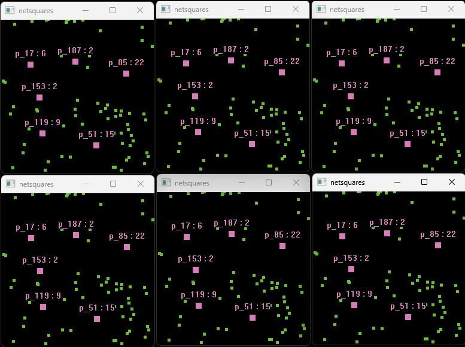

This is a small game project to solidify and test some netcode stuff before I
start implementing netcode on my larger game project (prototype 1 in my MEMO67
engine).

Initial idea as of 20250705 is:

  -Naive TCP login.
  -UDP game connections.
  -Slitherio-like game where square players eat world-spawned food.
  -Server will handle world state, players can be authoritative over their
  position and attempts to eat food.
  
20250711 - v.0

    As of 20250711 this project has the features outlined above, in a minimal
  functional state. This is mostly just test code, robustness should be
  addressed, some multithreading resource concurrency stuff needs handling,
  packets need to properly handle endianness, and overall structure should get
  some cleanup.
  

